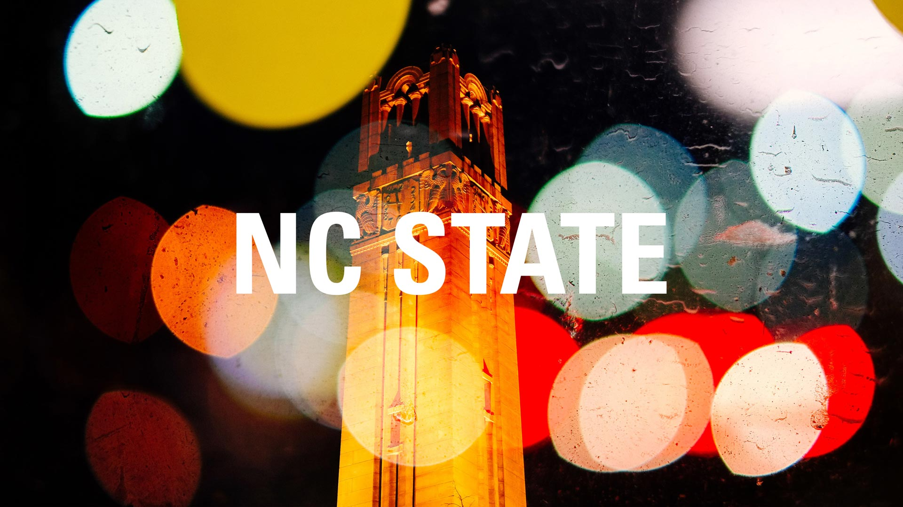

This website is made as a part of assignment submission for ST 558 course. The links below would lead to the blogs that one is interested in reading.

A few words about me: I am a 2nd year graduate student in Industrial Engineering at North Carolina State University. My research interests lie in Data Sciecne, Programming, Automation and Statistics. Having worked in industry for a couple of years, below are the blogs about my thoughts on Data Sciecne and how it differs from it's overlapping fields.

-------

You can reach out to me on my email address listed at the bottom of the page, and I would be more than happy to connect with you on LinkedIn. Happy reading!
